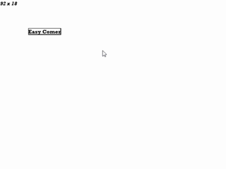
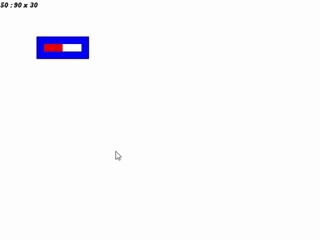
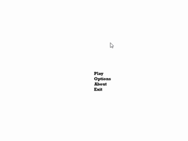
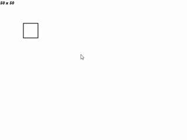
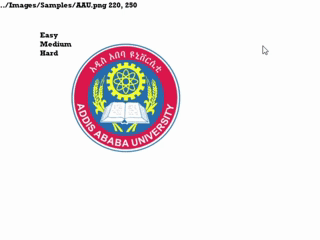
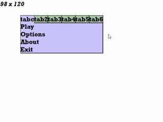
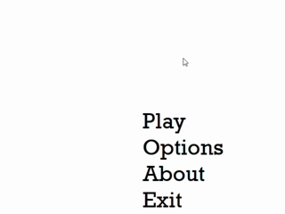
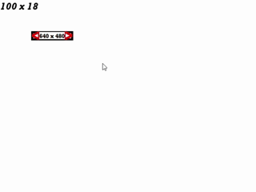
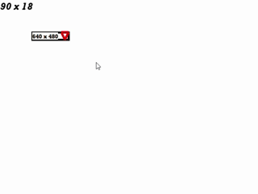
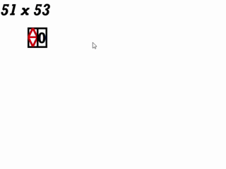

# 
 SDL2-Project 🎮 

A modular C++ framework built on SDL2 for experimenting with game engine features including GUI systems, physics, vector math, Lua scripting, and multimedia handling. This project serves as a flexible foundation for developing 2D games or interactive applications.

---
## 🧰 Tools and Languages used

   &nbsp;&nbsp;&nbsp;&nbsp;&nbsp;&nbsp;&nbsp;&nbsp;&nbsp;&nbsp;&nbsp;&nbsp;&nbsp;&nbsp;
   &nbsp;&nbsp;&nbsp;&nbsp;&nbsp;&nbsp;&nbsp;&nbsp;&nbsp;&nbsp;&nbsp;&nbsp;&nbsp;&nbsp;
   &nbsp;&nbsp;&nbsp;&nbsp;&nbsp;&nbsp;&nbsp;&nbsp;&nbsp;&nbsp;&nbsp;&nbsp;&nbsp;&nbsp;

---
## 📓 Description
<i> "All trademarks and logos are property of their respective owners.   some logos like OpenGL's and ffmpeg's were removed because of usage restrictions." </i>
### - [SDL](https://www.libsdl.org/) - Main driver of engine, allows cross-platform and low-level access to computer multi-media hardware components (audio, keyboard, mouse, joystick, graphics, etc).
### - [OpenGL](https://www.opengl.org/) - A popular cross-platform graphics library ([`in OpenGL branch`](https://github.com/Wildude/SDL2-Project/tree/OpenGL))
### - [zlib](https://zlib.net/) - compression/decompression library (used in decompressing tilemaps)
### - [ffmpeg](https://ffmpeg.org/) - video encoding/decoding library (helps view videos through program)
### - [lua](https://www.lua.org/) - a general purpose programming language (used for scripting in this context)
### 📚 Other libraries
### - [tinyxml](https://github.com/leethomason/tinyxml2): for XML parsing (useful in reading tilemaps from XML files) 
### - [base64](https://github.com/ReneNyffenegger/cpp-base64): decoding/encoding library (useful in decoding XML files that has tilemap data)

---
## 📁 Project Structure
<!-- Audio Files -->

<strong><a href="https://github.com/Wildude/SDL2-Project/tree/Master/">Audio/</a></strong>

  &nbsp &nbsp &nbsp &nbsp <i>Empty (for now)</i>  

<!-- Executables Files -->

<strong><a href="https://github.com/Wildude/SDL2-Project/tree/Master/Executables">Executables/</a></strong>

&nbsp &nbsp &nbsp &nbsp - <a href="https://github.com/Wildude/SDL2-Project/tree/Master/Executables/UI_test.exe">UI_test.exe</a>  
&nbsp &nbsp &nbsp &nbsp - <a href="https://github.com/Wildude/SDL2-Project/tree/Master/Executables/UI_test2.exe">UI_test2.exe</a>  
  &nbsp &nbsp &nbsp &nbsp - <a href="https://github.com/Wildude/SDL2-Project/tree/Master/Executables/UI_test3.exe">UI_test3.exe</a>  

<!-- Fonts Files -->

<strong><a href="https://github.com/Wildude/SDL2-Project/tree/Master/Fonts">Fonts/</a></strong>

&nbsp &nbsp &nbsp &nbsp - <a href="https://github.com/Wildude/SDL2-Project/tree/Master/Fonts/ROCK.TTF">ROCK.ttf</a>  
&nbsp &nbsp &nbsp &nbsp - <a href="https://github.com/Wildude/SDL2-Project/tree/Master/Fonts/ROCKB.TTF">ROCKB.ttf</a>  

<!-- Icons Files -->

<strong><a href="https://github.com/Wildude/SDL2-Project/tree/Master/Icons">Icons/</a></strong>

&nbsp &nbsp &nbsp &nbsp - <a href="https://github.com/Wildude/SDL2-Project/tree/Master/Icons/Addis_Ababa_University_logo.ico">AAU.ico</a>

<!-- Images Files -->

<strong><a href="https://github.com/Wildude/SDL2-Project/tree/Master/Images">Images/</a></strong>

&nbsp &nbsp &nbsp &nbsp - 
  <a href="https://github.com/Wildude/SDL2-Project/tree/Master/Images/Samples">Samples/</a>    
  &nbsp &nbsp &nbsp &nbsp &nbsp &nbsp &nbsp &nbsp - <a href="https://github.com/Wildude/SDL2-Project/tree/Master/Images/Samples/AAU.png">AAU.png</a>  
  &nbsp &nbsp &nbsp &nbsp &nbsp &nbsp &nbsp &nbsp - <a href="https://github.com/Wildude/SDL2-Project/tree/Master/Images/Samples/CS.jpg">CS.jpg</a>  
&nbsp &nbsp &nbsp &nbsp - 
  <a href="https://github.com/Wildude/SDL2-Project/tree/Master/Images/Stages">Stages/</a>  
  &nbsp &nbsp &nbsp &nbsp &nbsp &nbsp &nbsp &nbsp - <a href="https://github.com/Wildude/SDL2-Project/tree/Master/Images/Stages/Tilesets">Tilesets/</a>
  <a href="https://github.com/Wildude/SDL2-Project/tree/Master/Images/Stages/Tilesets/tileset_1bit.png">tileset_1bit.png</a>  
&nbsp &nbsp &nbsp &nbsp - 
  <a href="https://github.com/Wildude/SDL2-Project/tree/Master/Images/Weapons">Weapons/</a>  
  &nbsp &nbsp &nbsp &nbsp &nbsp &nbsp &nbsp &nbsp - <a href="https://github.com/Wildude/SDL2-Project/tree/Master/Images/Weapons/AK 47">AK47/</a>
  <a href="https://github.com/Wildude/SDL2-Project/tree/Master/Images/Weapons/AK 47/AK_47.png">AK_47.png</a>  
  &nbsp &nbsp &nbsp &nbsp &nbsp &nbsp &nbsp &nbsp - <a href="https://github.com/Wildude/SDL2-Project/tree/Master/Images/Weapons/fire">fire/</a>
  <a href="https://github.com/Wildude/SDL2-Project/tree/Master/Images/Weapons/fire/fire.png">fire.png</a>  

<!-- Headers Files -->

<strong><a href="https://github.com/Wildude/SDL2-Project/tree/Master/Headers">Headers/</a></strong>

&nbsp &nbsp &nbsp &nbsp - <a href="https://github.com/Wildude/SDL2-Project/tree/Master/Headers/Basic.hpp">Basic.hpp</a>  
&nbsp &nbsp &nbsp &nbsp - <a href="https://github.com/Wildude/SDL2-Project/tree/Master/Headers/BSDLF.hpp">BSDLF.hpp</a>  
&nbsp &nbsp &nbsp &nbsp - <a href="https://github.com/Wildude/SDL2-Project/tree/Master/Headers/SDL2_namespace.hpp">SDL2_namespace.hpp</a>  
&nbsp &nbsp &nbsp &nbsp - <a href="https://github.com/Wildude/SDL2-Project/tree/Master/Headers/vector2D.hpp">vector2D.hpp</a>  
&nbsp &nbsp &nbsp &nbsp - <a href="https://github.com/Wildude/SDL2-Project/tree/Master/Headers/command.hpp">command.hpp</a>  
&nbsp &nbsp &nbsp &nbsp - <a href="https://github.com/Wildude/SDL2-Project/tree/Master/Headers/GUI.hpp">GUI.hpp</a>  
&nbsp &nbsp &nbsp &nbsp - <a href="https://github.com/Wildude/SDL2-Project/tree/Master/Headers/physics.hpp">physics.hpp</a>  
&nbsp &nbsp &nbsp &nbsp - <a href="https://github.com/Wildude/SDL2-Project/tree/Master/Headers/rigid_body.hpp">rigid_body.hpp</a>  
&nbsp &nbsp &nbsp &nbsp - <a href="https://github.com/Wildude/SDL2-Project/tree/Master/Headers/Tilemap.hpp">Tilemap.hpp</a>  
&nbsp &nbsp &nbsp &nbsp - <a href="https://github.com/Wildude/SDL2-Project/tree/Master/Headers/scriptProcessor.hpp">scriptProcessor.hpp</a>  

<!-- Sample_codes Files -->

<strong><a href="https://github.com/Wildude/SDL2-Project/tree/Master/sample_codes">sample_codes/</a></strong>

&nbsp &nbsp &nbsp &nbsp - <i>Non-functional (and old) sample source codes</i>

<!-- Source_codes Files -->

<strong><a href="https://github.com/Wildude/SDL2-Project/tree/Master/source_codes">source_codes/</a></strong>

&nbsp &nbsp &nbsp &nbsp - <a href="https://github.com/Wildude/SDL2-Project/tree/Master/source_codes/UI_test.cpp">UI_test.cpp</a>  
&nbsp &nbsp &nbsp &nbsp - <a href="https://github.com/Wildude/SDL2-Project/tree/Master/source_codes/UI_test2.cpp">UI_test2.cpp</a>  
&nbsp &nbsp &nbsp &nbsp - <a href="https://github.com/Wildude/SDL2-Project/tree/Master/source_codes/UI_test3.cpp">UI_test3.cpp</a>  

<!-- SRC Files -->

<strong><a href="https://github.com/Wildude/SDL2-Project/tree/Master/src">src/</a></strong>

&nbsp &nbsp &nbsp &nbsp - <i>Where SDL, FFMPEG, LUA and ZLIB reisde (open at your own risk)</i>  

<!-- Design Files -->

<strong><a href="https://github.com/Wildude/SDL2-Project/tree/Master/design">design/</a></strong>

&nbsp &nbsp &nbsp &nbsp - <a href="https://github.com/Wildude/SDL2-Project/tree/Master/design/sample">sample/</a>  
&nbsp &nbsp &nbsp &nbsp &nbsp &nbsp &nbsp &nbsp - <a href="https://github.com/Wildude/SDL2-Project/tree/Master/design/sample/game_class.puml">game_class.puml</a>  
&nbsp &nbsp &nbsp &nbsp &nbsp &nbsp &nbsp &nbsp - <a href="https://github.com/Wildude/SDL2-Project/tree/Master/design/sample/sample1.uml">sample1.uml</a>  

<!-- Files Files -->

<strong><a href="https://github.com/Wildude/SDL2-Project/tree/Master/Files">Files/</a></strong>

&nbsp &nbsp &nbsp &nbsp - <a href="https://github.com/Wildude/SDL2-Project/tree/Master/Files/Data">Data/</a> <i>contains logging info (for monitoring)</i>  
&nbsp &nbsp &nbsp &nbsp - <a href="https://github.com/Wildude/SDL2-Project/tree/Master/Files/scripts">scripts/</a> <i>contains lua scripts (for scripting)</i>  
  &nbsp &nbsp &nbsp &nbsp - <a href="https://github.com/Wildude/SDL2-Project/tree/Master/Files/XML">XML/</a> <i>contains XML documents(for tilemap data)</i>  

## 😲❓ Recent changes
- Added a docs and design folder for clean system design.
- Added UI system
- Added command system
- Added scripting system

---
## 🎥 Screen records

   
   
   
   
   
   
   
   
   
   

---
## 📷 Screen shots

   
     
    
     
  
   
   

---
## 👩‍🔬 New concepts
### Rescaling images

- This speeds up image generation process since drawing is not required.
- The above image is an illustration of this concept.
- Initially the large images (The man, The leather jeans and shoes) were downloaded separately from the internet.
- They were then rescaled into a desirable size and stiched to each other via the app <a href ="https://graphicsgale.com/us/">GraphicsGale</a>.
- Then each parts of the now stiched man were partitioned and rescaled again to fit parts of the human body (according to the design needed by <a href = "Headers/rigid_body.hpp">rigid_body.hpp</a>
---
## 🤔 How to use?
### Windows
open up executables folder and run the programs.
### Linux
🤷compile and run
### MacOS
🤷‍♂️compile and run
